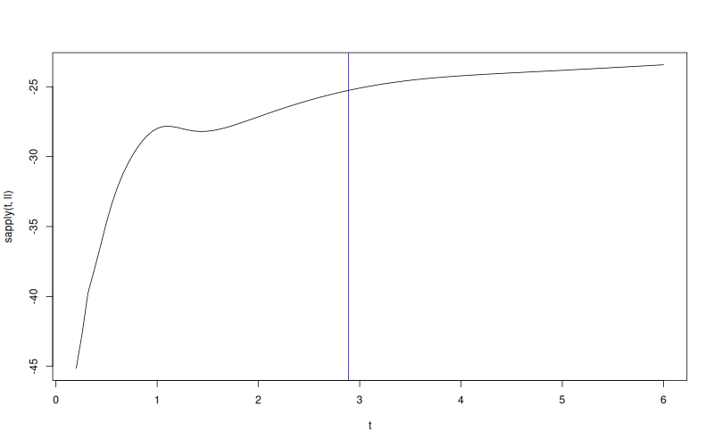

# `MLPKriging::logLikelihoodFun`

## Description

Evaluate the log-likelihood of an `MLPKriging` model at a given range parameter vector `theta`.

## Usage

* Python
    ```python
    # mk = MLPKriging(...)
    mk.logLikelihoodFun(theta, return_grad = False, return_hess = False)
    ```
* R
    ```r
    # mk <- MLPKriging(...)
    mk$logLikelihoodFun(theta, return_grad = FALSE, return_hess = FALSE)
    ```

* Julia
    ```julia
    # mk = MLPKriging(...)
    result = logLikelihoodFun(mk, theta, return_grad=false, return_hess=false)
    ```

## Arguments

Argument       |Description
-------------- |----------------
`theta`        | Numeric vector of correlation range parameters.
`return_grad`  | Logical. If `TRUE` also return the gradient. Default `FALSE`.
`return_hess`  | Logical. If `TRUE` also return the Hessian. Default `FALSE`.

## Value

A list with `logLikelihood` (scalar) and optionally `logLikelihoodGrad` and `logLikelihoodHess`.

## Examples

```r
f <- function(x) 1 - 1 / 2 * (sin(12 * x) / (1 + x) + 2 * cos(7 * x) * x^5 + 0.7)
X <- as.matrix(seq(0.05, 0.95, length.out = 10))
y <- f(X)

mk <- MLPKriging(
  y, X,
  hidden_dims = c(4L),
  d_out = 1L,
  activation = "tanh",
  kernel = "gauss",
  parameters = list(max_iter_adam = "20", max_iter_bfgs = "10")
)
print(mk)
ll <- function(theta) mk$logLikelihoodFun(theta)$logLikelihood

t <- seq(from = 0.2, to = 6, length.out = 101)
plot(t, sapply(t, ll), type = "l")
abline(v = mk$theta(), col = "blue")
```

### Results
```{literalinclude} examples/logLikelihoodFun.MLPKriging.md.Rout
:language: bash
```

## Reference

* Source: <https://github.com/libKriging/rlibkriging/blob/master/R/MLPKrigingClass.R#L205>

