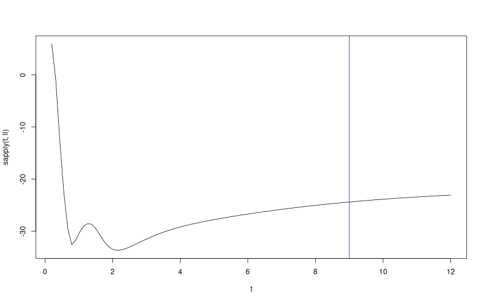

# `WarpKriging::logLikelihoodFun`


## Description

Compute the concentrated profile log-likelihood of a `WarpKriging`
model at an arbitrary value of the GP range parameters $\theta$
(keeping the currently-fitted warp parameters fixed).


## Usage

* Python
    ```python
    # wk = WarpKriging(...)
    wk.logLikelihoodFun(theta, return_grad = True, return_hess = False)
    ```
* R
    ```r
    # wk <- WarpKriging(...)
    wk$logLikelihoodFun(theta, return_grad = TRUE, return_hess = FALSE)
    ```
* Matlab/Octave
    ```octave
    % wk = WarpKriging(...)
    wk.logLikelihoodFun(theta, return_grad = true, return_hess = false)
    ```

* Julia
    ```julia
    # wk = WarpKriging(...)
    result = logLikelihoodFun(wk, theta, return_grad=false, return_hess=false)
    ```


## Arguments

Argument      |Description
------------- |----------------
`theta`     |     Value of the range parameters at which to evaluate the log-likelihood.
`return_grad`     |     Logical. If `TRUE` the analytical gradient with respect to $\log\theta$ is returned.
`return_hess`     |     Logical. If `TRUE` the Hessian is returned.


## Details

The warp parameters are held at their currently-stored values. The
function evaluates the concentrated profile log-likelihood (with
$\hat\sigma^2$ and $\hat\beta$ computed analytically) as a function of
$\theta$ alone.


## Value

A list with fields `logLikelihood`, optionally `logLikelihoodGrad`
(vector w.r.t. $\log\theta$) and `logLikelihoodHess`.

## Examples

```r
f <- function(x) 1 - 1 / 2 * (sin(12 * x) / (1 + x) + 2 * cos(7 * x) * x^5 + 0.7)
X <- as.matrix(seq(0.05, 0.95, length.out = 10))
y <- f(X)

wk <- WarpKriging(
  y, X,
  warping = "kumaraswamy",
  kernel = "gauss",
  parameters = list(max_iter_adam = "20", max_iter_bfgs = "10")
)
print(wk)
ll <- function(theta) wk$logLikelihoodFun(theta)$logLikelihood

t <- seq(from = 0.2, to = 12, length.out = 101)
plot(t, sapply(t, ll), type = "l")
abline(v = wk$theta(), col = "blue")
```

### Results
```{literalinclude} examples/logLikelihoodFun.WarpKriging.md.Rout
:language: bash
```

