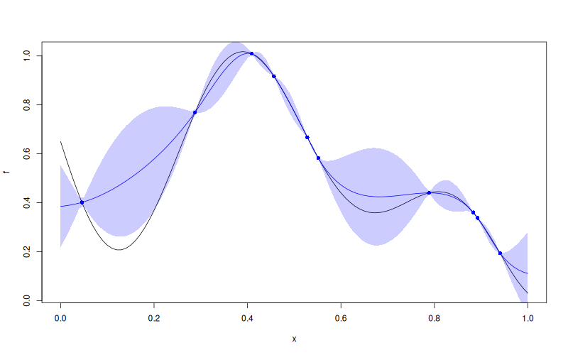

# `Kriging::predict`


## Description

Predict from a `Kriging` Model Object


## Usage

* Python
    ```python
    # k = Kriging(...)
    k.predict(x, return_stdev = True, return_cov = False, return_deriv = False)
    ```
* R
    ```r
    # k = Kriging(...)
    k$predict(x, return_stdev = TRUE, return_cov = FALSE, return_deriv = FALSE)
    ```
* Matlab/Octave
    ```octave
    % k = Kriging(...)
    k.predict(x, return_stdev = true, return_cov = false, return_deriv = false)
    ```

* Julia
    ```julia
    # k = Kriging(...)
    p = predict(k, x, return_stdev=true, return_cov=false, return_deriv=false)
    println(p.mean)
    println(p.stdev)
    ```

## Arguments

Argument      |Description
------------- |----------------
`x`     |     Input points where the prediction must be computed.
`return_stdev`     |     `Logical` . If `TRUE` the standard deviation is returned.
`return_cov`     |     `Logical` . If `TRUE` the covariance matrix of the predictions is returned.
`return_deriv`     |     `Logical` . If `TRUE` the derivatives of mean and sd of the predictions are returned.


## Details

Given $n^\star$ "new" input points $\mathbf{x}^\star_{j}$, the method
compute the expectation, the standard deviation and (optionally) the covariance
of the "new" observations $y(\mathbf{x}^\star_j)$ of the
stochastic process, conditional on the $n$ values $y(\mathbf{x}_i)$ at
the input points $\mathbf{x}_i$ as used when fitting the model. The
$n^\star$ input vectors (with length $d$) are given as the rows of a
$\mathbf{X}^\star$ corresponding to `x`.

The computation of these quantities is often called *Universal
Kriging* see [here](SecPredAndSim) for more details.


## Value

A list containing the element `mean` and, depending on the requested flags, `stdev`, `cov`, `mean_deriv`, and `stdev_deriv`.

- `mean` is the conditional expectation at the prediction inputs.
- `stdev` is the vector of conditional standard deviations when `return_stdev = TRUE`.
- `cov` is the conditional covariance matrix when `return_cov = TRUE`.
- `mean_deriv` and `stdev_deriv` are the optional derivative matrices returned when `return_deriv = TRUE`.

For `noise = NULL`, prediction is an interpolation.

## Examples

```r
f <- function(x) 1 - 1 / 2 * (sin(12 * x) / (1 + x) + 2 * cos(7 * x) * x^5 + 0.7)
plot(f)
set.seed(123)
X <- as.matrix(runif(10))
y <- f(X)
points(X, y, col = "blue", pch = 16)

k <- Kriging(y, X, "matern3_2")

x <-seq(from = 0, to = 1, length.out = 101)
p <- k$predict(x)

lines(x, p$mean, col = "blue")
polygon(c(x, rev(x)), c(p$mean - 2 * p$stdev, rev(p$mean + 2 * p$stdev)), border = NA, col = rgb(0, 0, 1, 0.2))
```

### Results
```{literalinclude} examples/predict.Kriging.md.Rout
:language: bash
```

## Reference

* Source: <https://github.com/libKriging/rlibkriging/blob/master/R/KrigingClass.R#L337>
