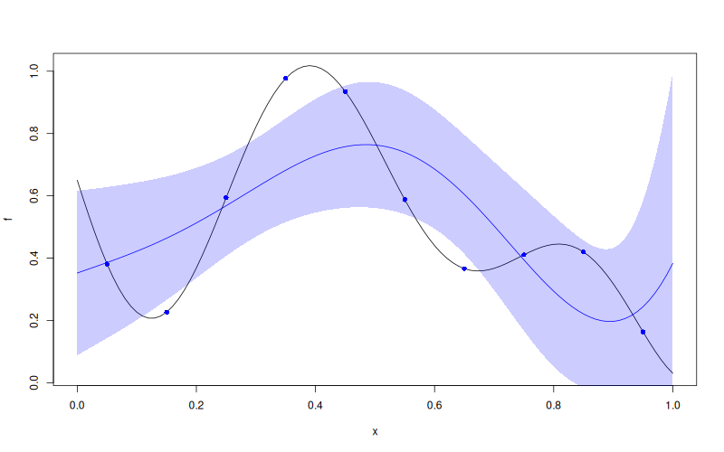

# `MLPKriging::predict`

## Description

Predict the mean (and optionally standard deviation / covariance) from an `MLPKriging` model.

## Usage

* Python
    ```python
    # mk = MLPKriging(...)
    mk.predict(x, return_stdev = True, return_cov = False, return_deriv = False)
    ```
* R
    ```r
    # mk <- MLPKriging(...)
    mk$predict(x, return_stdev = TRUE, return_cov = FALSE, return_deriv = FALSE)
    ```

* Julia
    ```julia
    # mk = MLPKriging(...)
    p = predict(mk, x, return_stdev=true, return_cov=false, return_deriv=false)
    println(p.mean)
    println(p.stdev)
    ```

## Arguments

Argument        |Description
--------------- |----------------
`x`             | Numeric matrix of prediction points ($m \times d$).
`return_stdev`  | Logical. If `TRUE` return the posterior standard deviation vector. Default `TRUE`.
`return_cov`    | Logical. If `TRUE` return the full posterior covariance matrix. Default `FALSE`.
`return_deriv`  | Logical. If `TRUE` return the derivatives of mean and stdev w.r.t. `x`. Default `FALSE`.

## Value

A list with:
* `mean` — numeric vector of posterior mean values at `x`.
* `stdev` — (if `return_stdev = TRUE`) numeric vector of posterior standard deviations.
* `cov` — (if `return_cov = TRUE`) posterior covariance matrix.
* `mean_deriv`, `stdev_deriv` — (if `return_deriv = TRUE`) derivative matrices.

## Examples

```r
f <- function(x) 1 - 1 / 2 * (sin(12 * x) / (1 + x) + 2 * cos(7 * x) * x^5 + 0.7)
X <- as.matrix(seq(0.05, 0.95, length.out = 10))
y <- f(X)

mk <- MLPKriging(
  y, X,
  hidden_dims = c(4L),
  d_out = 1L,
  activation = "tanh",
  kernel = "gauss",
  parameters = list(max_iter_adam = "20", max_iter_bfgs = "10")
)
x <- as.matrix(seq(0, 1, length.out = 101))
p <- mk$predict(x, return_stdev = TRUE)

plot(f)
points(X, y, col = "blue", pch = 16)
lines(x, p$mean, col = "blue")
polygon(c(x, rev(x)), c(p$mean - 2 * p$stdev, rev(p$mean + 2 * p$stdev)),
        border = NA, col = rgb(0, 0, 1, 0.2))
```

### Results
```{literalinclude} examples/predict.MLPKriging.md.Rout
:language: bash
```

