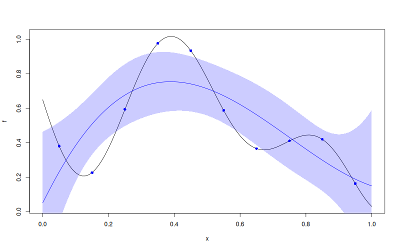

# `WarpKriging::predict`


## Description

Predict from a `WarpKriging` Model Object. The prediction is performed
in the warped feature space $\Phi(\mathbf{x})$.


## Usage

* Python
    ```python
    # wk = WarpKriging(...)
    wk.predict(x, return_stdev = True, return_cov = False, return_deriv = False)
    ```
* R
    ```r
    # wk <- WarpKriging(...)
    wk$predict(x, return_stdev = TRUE, return_cov = FALSE, return_deriv = FALSE)
    ```
* Matlab/Octave
    ```octave
    % wk = WarpKriging(...)
    wk.predict(x, return_stdev = true, return_cov = false, return_deriv = false)
    ```

* Julia
    ```julia
    # wk = WarpKriging(...)
    p = predict(wk, x, return_stdev=true, return_cov=false, return_deriv=false)
    println(p.mean)
    println(p.stdev)
    ```


## Arguments

Argument      |Description
------------- |----------------
`x`     |     Input points where the prediction must be computed (original input space — warping is applied internally).
`return_stdev`     |     Logical. If `TRUE` the standard deviation is returned.
`return_cov`     |     Logical. If `TRUE` the covariance matrix of the predictions is returned.
`return_deriv`     |     Logical. If `TRUE` the derivatives of the mean and sd with respect to the new input points are returned (computed through the warping via the chain rule).


## Details

For new input points $\mathbf{x}^\star$, the method computes the
posterior mean and (optionally) standard deviation / covariance
conditionally on the training observations:

$$
\mathbb{E}[y(\mathbf{x}^\star) \,|\, \mathbf{y}]
\;=\; \mathbf{f}(\mathbf{x}^\star)^\top \hat\beta
\;+\; r(\Phi(\mathbf{x}^\star))^\top R^{-1}(\mathbf{y} - F\hat\beta).
$$

The computation uses the warped design $\Phi(\mathbf{X})$ cached at fit
time. Returning derivatives is more expensive than for a plain `Kriging`
model because the chain rule must be propagated through each warp.


## Value

A list containing `mean` and optionally `stdev`, `cov`, `pred_mean_deriv`,
`pred_stdev_deriv`. Note that for a `WarpKriging` object the prediction
is an interpolation at the training points (like `Kriging`).

## Examples

```r
f <- function(x) 1 - 1 / 2 * (sin(12 * x) / (1 + x) + 2 * cos(7 * x) * x^5 + 0.7)
X <- as.matrix(seq(0.05, 0.95, length.out = 10))
y <- f(X)

wk <- WarpKriging(
  y, X,
  warping = "kumaraswamy",
  kernel = "gauss",
  parameters = list(max_iter_adam = "20", max_iter_bfgs = "10")
)
x <- as.matrix(seq(0, 1, length.out = 101))
p <- wk$predict(x, return_stdev = TRUE)

plot(f)
points(X, y, col = "blue", pch = 16)
lines(x, p$mean, col = "blue")
polygon(c(x, rev(x)), c(p$mean - 2 * p$stdev, rev(p$mean + 2 * p$stdev)),
        border = NA, col = rgb(0, 0, 1, 0.2))
```

### Results
```{literalinclude} examples/predict.WarpKriging.md.Rout
:language: bash
```

