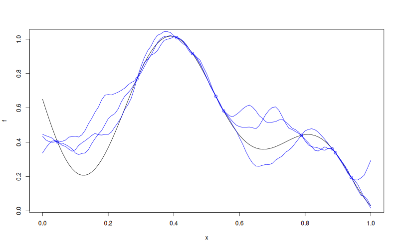

# `Kriging::simulate`


## Description

Simulate from a `Kriging` Model Object.


## Usage

* Python
    ```python
    # k = Kriging(...)
    k.simulate(nsim = 1, seed = 123, x = x, will_update = False)
    ```
* R
    ```r
    # k = Kriging(...)
    k$simulate(nsim = 1, seed = 123, x = x, will_update = FALSE)
    ```
* Matlab/Octave
    ```octave
    % k = Kriging(...)
    k.simulate(nsim = 1, seed = 123, x = x, will_update = false)
    ```

* Julia
    ```julia
    # k = Kriging(...)
    s = simulate(k, nsim=1, seed=123, x=x, will_update=false)
    ```

## Arguments

Argument      |Description
------------- |----------------
`nsim`     |     Number of simulations to perform.
`seed`     |     Random seed used.
`x`     |     Points in model input space where to simulate.
`will_update`     |     Set to `TRUE` if you plan to call `update_simulate(...)` afterwards.

## Details

This method draws $n_{\texttt{sim}}$ conditional paths of the latent process at the new input points.

The exact simulation mode follows the fitted `noise` strategy: `noise = NULL` gives interpolation paths, `noise = "nugget"` uses the nugget model, and `noise = <variance vector>` uses the heteroskedastic model. Set `will_update = TRUE` to cache the simulation state for a later `update_simulate(...)` call.

## Value

A matrix with `nrow(x)` rows and `nsim` columns containing the simulated paths at the input points given in `x`.

## Examples

```r
f <- function(x) 1 - 1 / 2 * (sin(12 * x) / (1 + x) + 2 * cos(7 * x) * x^5 + 0.7)
plot(f)
set.seed(123)
X <- as.matrix(runif(10))
y <- f(X)
points(X, y, col = "blue")

k <- Kriging(y, X, kernel = "matern3_2")

x <- seq(from = 0, to = 1, length.out = 101)
s <- k$simulate(nsim = 3, x = x)

lines(x, s[ , 1], col = "blue")
lines(x, s[ , 2], col = "blue")
lines(x, s[ , 3], col = "blue")
```

### Results
```{literalinclude} examples/simulate.Kriging.md.Rout
:language: bash
```

## Reference

* Source: <https://github.com/libKriging/rlibkriging/blob/master/R/KrigingClass.R#L397>
