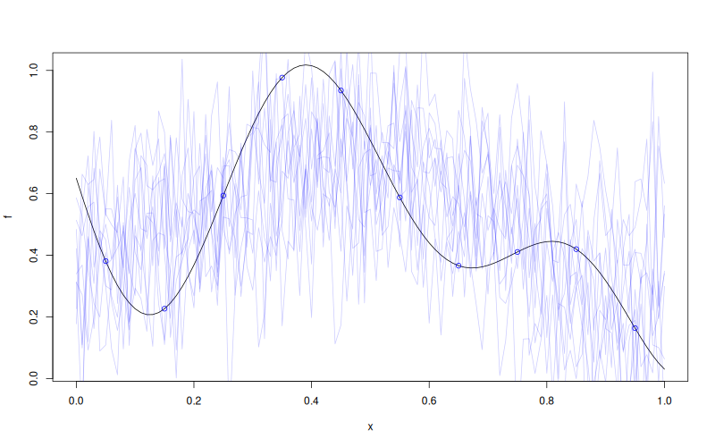

# `MLPKriging::simulate`

## Description

Simulate paths from an `MLPKriging` model.

## Usage

* Python
    ```python
    # mk = MLPKriging(...)
    mk.simulate(nsim = 1, seed = 123, x, will_update = False)
    ```
* R
    ```r
    # mk <- MLPKriging(...)
    mk$simulate(nsim = 1, seed = 123, x, will_update = FALSE)
    ```

* Julia
    ```julia
    # mk = MLPKriging(...)
    s = simulate(mk, nsim=1, seed=123, x)
    ```

## Arguments

Argument      |Description
------------- |----------------
`nsim`        | Number of simulation paths. Default `1`.
`seed`        | Random seed. Default `123`.
`x`           | Numeric matrix of simulation points ($m \times d$).
`will_update` | Logical. Set to `TRUE` if `update_simulate` will be called afterwards. Default `FALSE`.

## Value

A matrix with `nrow(x)` rows and `nsim` columns containing the simulated paths.

## Examples

```r
f <- function(x) 1 - 1 / 2 * (sin(12 * x) / (1 + x) + 2 * cos(7 * x) * x^5 + 0.7)
X <- as.matrix(seq(0.05, 0.95, length.out = 10))
y <- f(X)

mk <- MLPKriging(
  y, X,
  hidden_dims = c(4L),
  d_out = 1L,
  activation = "tanh",
  kernel = "gauss",
  parameters = list(max_iter_adam = "20", max_iter_bfgs = "10")
)
x <- as.matrix(seq(0, 1, length.out = 101))
s <- mk$simulate(nsim = 10, seed = 123, x = x)

plot(f)
points(X, y, col = "blue")
matlines(x, s, col = rgb(0, 0, 1, 0.2), type = "l", lty = 1)
```

### Results
```{literalinclude} examples/simulate.MLPKriging.md.Rout
:language: bash
```

