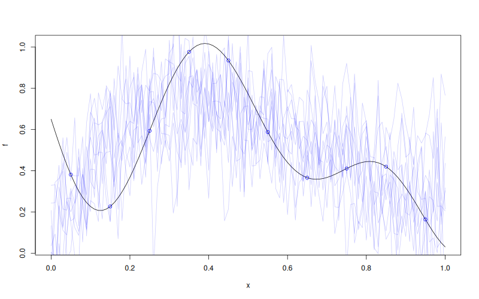

# `WarpKriging::simulate`


## Description

Simulate from a `WarpKriging` Model Object.


## Usage

* Python
    ```python
    # wk = WarpKriging(...)
    wk.simulate(nsim = 1, seed = 123, x)
    ```
* R
    ```r
    # wk <- WarpKriging(...)
    wk$simulate(nsim = 1, seed = 123, x)
    ```
* Matlab/Octave
    ```octave
    % wk = WarpKriging(...)
    wk.simulate(nsim = 1, seed = 123, x)
    ```

* Julia
    ```julia
    # wk = WarpKriging(...)
    s = simulate(wk, nsim=1, seed=123, x)
    ```


## Arguments

Argument      |Description
------------- |----------------
`nsim`     |     Number of simulations to draw.
`seed`     |     Random seed used.
`x`     |     Points in model input space (original, un-warped) where to simulate.
`will_update` |     Logical. Set to `TRUE` if `update_simulate(...)` will be called afterwards.

## Details

Draws $n_{\texttt{sim}}$ conditional paths of the GP at the new input
points, using the posterior covariance computed in the warped feature
space $\Phi(\mathbf{x})$.


## Value

A matrix with `nrow(x)` rows and `nsim` columns containing the simulated
paths at the input points given in `x`.

## Examples

```r
f <- function(x) 1 - 1 / 2 * (sin(12 * x) / (1 + x) + 2 * cos(7 * x) * x^5 + 0.7)
X <- as.matrix(seq(0.05, 0.95, length.out = 10))
y <- f(X)

wk <- WarpKriging(
  y, X,
  warping = "kumaraswamy",
  kernel = "gauss",
  parameters = list(max_iter_adam = "20", max_iter_bfgs = "10")
)
x <- as.matrix(seq(0, 1, length.out = 101))
s <- wk$simulate(nsim = 10, seed = 123, x = x)

plot(f)
points(X, y, col = "blue")
matlines(x, s, col = rgb(0, 0, 1, 0.2), type = "l", lty = 1)
```

### Results
```{literalinclude} examples/simulate.WarpKriging.md.Rout
:language: bash
```

