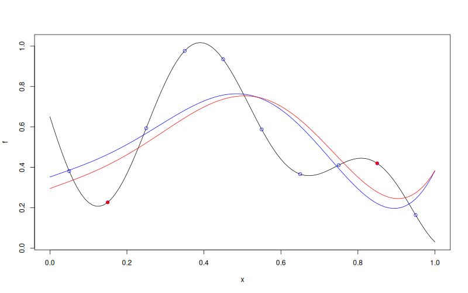

# `MLPKriging::update`

## Description

Update an `MLPKriging` model with new observations (permanently added to the dataset).

## Usage

* Python
    ```python
    # mk = MLPKriging(...)
    mk.update(y_u, X_u, refit = True)
    ```
* R
    ```r
    # mk <- MLPKriging(...)
    mk$update(y_u, X_u, refit = TRUE)
    ```
* Matlab/Octave
    ```octave
    % mk = MLPKriging(...)
    mk.update(y_u, X_u, refit = true)
    ```
* Julia
    ```julia
    # mk = MLPKriging(...)
    update(mk, y_u, X_u, refit=true)
    ```

## Arguments

Argument  |Description
--------- |----------------
`y_u`     | Numeric vector of new response values.
`X_u`     | Numeric matrix of new input points.
`refit`   | Logical. If `TRUE` (default) the model is re-optimised after adding the new points.

## Details

The new observations are appended to the dataset used by the latent MLP feature extractor and GP head. Set `refit = TRUE` to re-optimise the feature extractor and GP hyper-parameters jointly.

## Value

No return value. The `MLPKriging` object is modified in place.

## Examples

```r
f <- function(x) 1 - 1 / 2 * (sin(12 * x) / (1 + x) + 2 * cos(7 * x) * x^5 + 0.7)
X <- as.matrix(seq(0.05, 0.95, length.out = 10))
y <- f(X)

mk <- MLPKriging(
  y, X,
  hidden_dims = c(4L),
  d_out = 1L,
  activation = "tanh",
  kernel = "gauss",
  parameters = list(max_iter_adam = "20", max_iter_bfgs = "10")
)
plot(f)
points(X, y, col = "blue")

x <- as.matrix(seq(0, 1, length.out = 101))
p <- mk$predict(x, return_stdev = TRUE)
lines(x, p$mean, col = "blue")

X_u <- as.matrix(c(0.15, 0.85))
y_u <- f(X_u)
mk$update(y_u, X_u)
points(X_u, y_u, col = "red", pch = 16)

p_u <- mk$predict(x, return_stdev = TRUE)
lines(x, p_u$mean, col = "red")
```

### Results
```{literalinclude} examples/update.MLPKriging.md.Rout
:language: bash
```

## Reference

* Source: <https://github.com/libKriging/rlibkriging/blob/master/R/MLPKrigingClass.R#L186>
