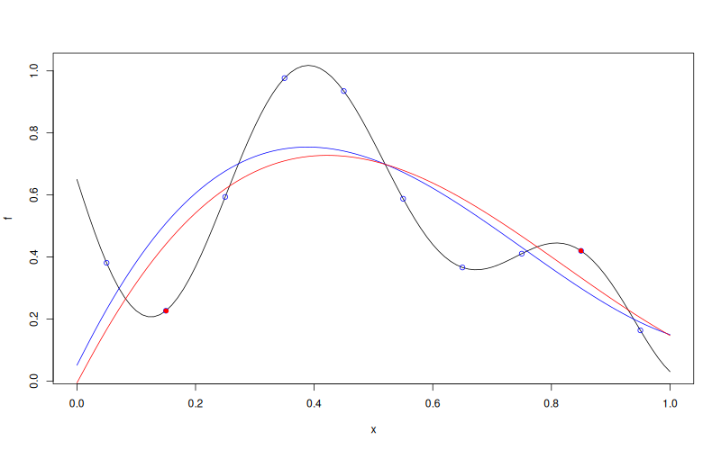

# `WarpKriging::update`


## Description

Update a `WarpKriging` model with new observations.


## Usage

* Python
    ```python
    # wk = WarpKriging(...)
    wk.update(y_u, X_u, refit = True)
    ```
* R
    ```r
    # wk <- WarpKriging(...)
    wk$update(y_u, X_u, refit = TRUE)
    ```
* Matlab/Octave
    ```octave
    % wk = WarpKriging(...)
    wk.update(y_u, X_u, refit = true)
    ```

* Julia
    ```julia
    # wk = WarpKriging(...)
    update(wk, y_u, X_u, refit=true)
    ```

## Arguments

Argument      |Description
------------- |----------------
`y_u`     |     Numeric vector of new response values.
`X_u`     |     Numeric matrix of new input points.
`refit`   |     Logical. If `TRUE` (default), re-optimise the warp and GP hyper-parameters after appending the new data.

## Details

The new observations are appended to the training set in the original input space, then re-encoded through the fitted warping specification. Set `refit = FALSE` to reuse the current warp and GP hyper-parameters; set `refit = TRUE` to re-optimise them jointly.

## Value

No return value. The `WarpKriging` object is modified in place.

## Examples

```r
f <- function(x) 1 - 1 / 2 * (sin(12 * x) / (1 + x) + 2 * cos(7 * x) * x^5 + 0.7)
X <- as.matrix(seq(0.05, 0.95, length.out = 10))
y <- f(X)

wk <- WarpKriging(
  y, X,
  warping = "kumaraswamy",
  kernel = "gauss",
  parameters = list(max_iter_adam = "20", max_iter_bfgs = "10")
)
plot(f)
points(X, y, col = "blue")

x <- as.matrix(seq(0, 1, length.out = 101))
p <- wk$predict(x, return_stdev = TRUE)
lines(x, p$mean, col = "blue")

X_u <- as.matrix(c(0.15, 0.85))
y_u <- f(X_u)
wk$update(y_u, X_u)
points(X_u, y_u, col = "red", pch = 16)

p_u <- wk$predict(x, return_stdev = TRUE)
lines(x, p_u$mean, col = "red")
```

### Results
```{literalinclude} examples/update.WarpKriging.md.Rout
:language: bash
```

