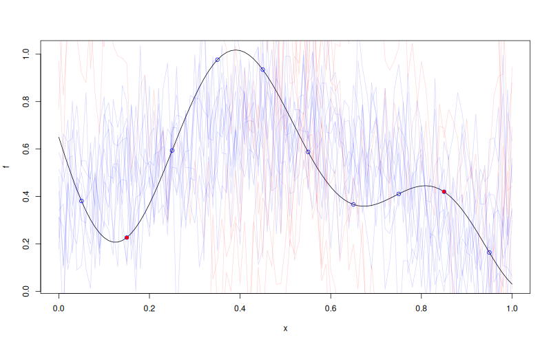

# `MLPKriging::update_simulate`

## Description

Update previously simulated paths of an `MLPKriging` model with new observations (FOXY algorithm).
Must have called `simulate(..., will_update = TRUE)` first.

## Usage

* Python
    ```python
    # mk = MLPKriging(...)
    # mk.simulate(nsim = 1, seed = 123, x = x, will_update = True)
    mk.update_simulate(y_u, X_u)
    ```
* R
    ```r
    # mk <- MLPKriging(...)
    # mk$simulate(nsim = 1, seed = 123, x = x, will_update = TRUE)
    mk$update_simulate(y_u, X_u)
    ```
* Matlab/Octave
    ```octave
    % mk = MLPKriging(...)
    % mk.simulate(nsim = 1, seed = 123, x = x, will_update = true)
    mk.update_simulate(y_u, X_u)
    ```
* Julia
    ```julia
    # mk = MLPKriging(...)
    # simulate(mk, nsim=1, seed=123, x=x, will_update=true)
    update_simulate(mk, y_u, X_u)
    ```

## Arguments

Argument  |Description
--------- |----------------
`y_u`     | Numeric vector of new observations.
`X_u`     | Numeric matrix of new input points.

## Details

This method applies the FOXY-style update to the previously cached simulation state. A prior call to `simulate(..., will_update = TRUE)` is required.

## Value

A matrix with `nrow(x)` rows and `nsim` columns of updated simulated paths.

## Examples

```r
f <- function(x) 1 - 1 / 2 * (sin(12 * x) / (1 + x) + 2 * cos(7 * x) * x^5 + 0.7)
X <- as.matrix(seq(0.05, 0.95, length.out = 10))
y <- f(X)

mk <- MLPKriging(
  y, X,
  hidden_dims = c(4L),
  d_out = 1L,
  activation = "tanh",
  kernel = "gauss",
  parameters = list(max_iter_adam = "20", max_iter_bfgs = "10")
)
x <- as.matrix(seq(0, 1, length.out = 101))
s <- mk$simulate(nsim = 10, seed = 123, x = x, will_update = TRUE)

X_u <- as.matrix(c(0.15, 0.85))
y_u <- f(X_u)
s_u <- mk$update_simulate(y_u, X_u)
cat("Updated simulation size:", dim(s_u), "\n")

plot(f)
points(X, y, col = "blue")
points(X_u, y_u, col = "red", pch = 16)
matlines(x, s, col = rgb(0, 0, 1, 0.15), type = "l", lty = 1)
matlines(x, s_u, col = rgb(1, 0, 0, 0.15), type = "l", lty = 1)
```

### Results
```{literalinclude} examples/update_simulate.MLPKriging.md.Rout
:language: bash
```

