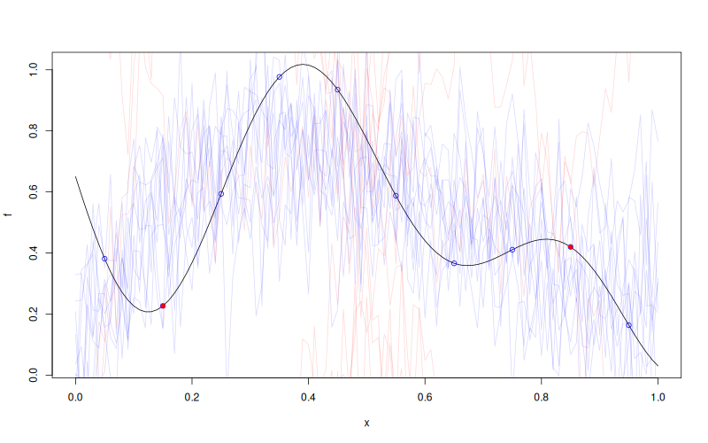

# `WarpKriging::update_simulate`

## Description

Update previous simulation of a `WarpKriging` model object.

This method draws paths of the stochastic process conditional on the values at the input points used in the
fit, plus the new input points and their values given as argument (known as 'update' points).

## Usage

* Python
    ```python
    # wk = WarpKriging(...)
    # wk.simulate(nsim = 1, seed = 123, x, will_update = True)
    wk.update_simulate(y_u, X_u)
    ```
* R
    ```r
    # wk <- WarpKriging(...)
    # wk$simulate(nsim = 1, seed = 123, x, will_update = TRUE)
    wk$update_simulate(y_u, X_u)
    ```
* Matlab/Octave
    ```octave
    % wk = WarpKriging(...)
    % wk.simulate(nsim = 1, seed = 123, x, will_update = true)
    wk.update_simulate(y_u, X_u)
    ```
* Julia
    ```julia
    # wk = WarpKriging(...)
    # simulate(wk, nsim=1, seed=123, x, will_update=true)
    update_simulate(wk, y_u, X_u)
    ```

## Arguments

Argument  |Description
--------- |----------------
`y_u`     |     Numeric vector of new responses (output).
`X_u`     |     Numeric matrix of new input points.

## Details

This method draws $n_{\texttt{sim}}$ paths of the stochastic process
$y(\mathbf{x})$ at the $n^\star$ given new input points
$\mathbf{x}^\star_j$ conditional on the values $y(\mathbf{x}_i)$ at
the input points used in the fit, plus the new input points and their values given as argument (known as 'update' points).

## Value

A matrix with `nrow(x)` rows and `nsim` columns containing the updated
simulated paths at the input points given in `x`.

## Examples

```r
f <- function(x) 1 - 1 / 2 * (sin(12 * x) / (1 + x) + 2 * cos(7 * x) * x^5 + 0.7)
X <- as.matrix(seq(0.05, 0.95, length.out = 10))
y <- f(X)

wk <- WarpKriging(
  y, X,
  warping = "kumaraswamy",
  kernel = "gauss",
  parameters = list(max_iter_adam = "20", max_iter_bfgs = "10")
)
x <- as.matrix(seq(0, 1, length.out = 101))
s <- wk$simulate(nsim = 10, seed = 123, x = x, will_update = TRUE)

X_u <- as.matrix(c(0.15, 0.85))
y_u <- f(X_u)
s_u <- wk$update_simulate(y_u, X_u)
cat("Updated simulation size:", dim(s_u), "\n")

plot(f)
points(X, y, col = "blue")
points(X_u, y_u, col = "red", pch = 16)
matlines(x, s, col = rgb(0, 0, 1, 0.15), type = "l", lty = 1)
matlines(x, s_u, col = rgb(1, 0, 0, 0.15), type = "l", lty = 1)
```

### Results
```{literalinclude} examples/update_simulate.WarpKriging.md.Rout
:language: bash
```

