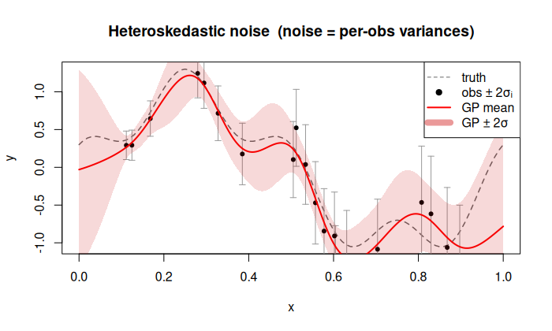
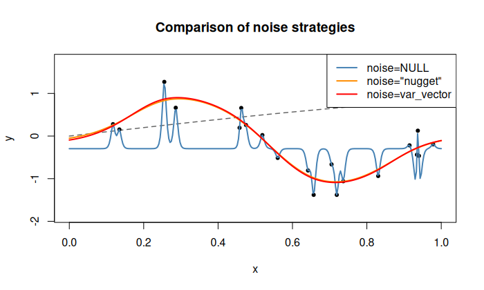

# Heteroskedastic noise (known per-observation variance)

## Description

Pass a **numeric vector** of length $n$ as `noise` to supply per-observation
noise variances $\sigma^2_1, \dots, \sigma^2_n$:

$$
\mathrm{Cov}(y_i, y_j) = \sigma^2\,k(\mathbf{x}_i, \mathbf{x}_j) + \sigma^2_i\,\delta_{ij}.
$$

The noise variances are treated as **fixed and known** — they are not
estimated from data. The GP variance $\sigma^2$ and ranges $\theta$ are still
optimised by maximising the log-likelihood.

## When to use

* **Physical experiments** where the measurement uncertainty is known
  (e.g. from repeated runs, sensor specs, or error propagation).
* **Multi-fidelity / ensemble data** where each observation has a different
  known accuracy.
* Observations that are themselves **averages** of $m_i$ replicates:
  set $\sigma^2_i = s^2 / m_i$.

## Usage

```r
k <- Kriging(y, X, kernel = "matern5_2", noise = noise_var)
```

## Example — varying measurement precision

```r
library(rlibkriging)

f <- function(x) sin(2 * pi * x) + 0.3 * cos(8 * pi * x)
set.seed(3)
n <- 20
X <- as.matrix(sort(runif(n)))

noise_sd <- 0.05 + 0.4 * X[, 1]
noise_var <- noise_sd^2
y <- f(X) + rnorm(n, sd = noise_sd)

k <- Kriging(y, X, kernel = "matern5_2", noise = noise_var)

x <- as.matrix(seq(0, 1, length.out = 300))
p <- k$predict(x, return_stdev = TRUE)

plot(f, xlim = c(0, 1), col = "grey40", lty = 2, lwd = 1,
     ylab = "y", main = "Heteroskedastic noise")
arrows(X, y - 2 * noise_sd, X, y + 2 * noise_sd,
       length = 0.04, angle = 90, code = 3, col = "grey60")
points(X, y, pch = 19, cex = 0.7)
lines(x, p$mean, col = "red", lwd = 2)
polygon(c(x, rev(x)),
        c(p$mean - 2 * p$stdev, rev(p$mean + 2 * p$stdev)),
        border = NA, col = rgb(0.8, 0, 0, 0.15))
legend("topright",
       c("truth", "obs ±2σ_i", "GP mean", "GP ±2σ"),
       lty = c(2, NA, 1, 1),
       pch = c(NA, 19, NA, NA),
       col = c("grey40", "black", "red", rgb(0.8, 0, 0, 0.4)),
       lwd = c(1, NA, 2, 8))
```



## Example — updating with new noisy observations

```r
library(rlibkriging)

f <- function(x) sin(2 * pi * x)
set.seed(10)
n <- 15
X <- as.matrix(runif(n))
nv <- rep(0.04, n)
y <- f(X) + rnorm(n, sd = sqrt(nv))

k <- Kriging(y, X, kernel = "gauss", noise = nv)

X_u <- as.matrix(runif(5))
nv_u <- runif(5, 0.01, 0.2)
y_u <- f(X_u) + rnorm(5, sd = sqrt(nv_u))

k$update(y_u, X_u, noise_u = nv_u)

x <- as.matrix(seq(0, 1, length.out = 200))
p <- k$predict(x, return_stdev = TRUE)

plot(f, xlim = c(0, 1), col = "grey40", lty = 2, lwd = 1,
     ylab = "y", main = "Heteroskedastic noise — after update")
points(X, y, pch = 19, col = "steelblue", cex = 0.8)
points(X_u, y_u, pch = 17, col = "red", cex = 0.8)
lines(x, p$mean, lwd = 2)
polygon(c(x, rev(x)),
        c(p$mean - 2 * p$stdev, rev(p$mean + 2 * p$stdev)),
        border = NA, col = rgb(0, 0, 0, 0.1))
legend("topright", c("initial obs", "new obs"), pch = c(19, 17),
       col = c("steelblue", "red"))
```

## Comparison of three strategies

```r
library(rlibkriging)

f <- function(x) sin(2 * pi * x)
set.seed(42)
n <- 20
X <- as.matrix(runif(n))
nv <- rep(0.05, n)
y <- f(X) + rnorm(n, sd = sqrt(nv))

k_none <- Kriging(y, X, kernel = "matern5_2")
k_nugget <- Kriging(y, X, kernel = "matern5_2", noise = "nugget")
k_noise <- Kriging(y, X, kernel = "matern5_2", noise = nv)

x <- as.matrix(seq(0, 1, length.out = 300))
p0 <- k_none$predict(x, return_stdev = TRUE)
p1 <- k_nugget$predict(x, return_stdev = TRUE)
p2 <- k_noise$predict(x, return_stdev = TRUE)

cols <- c("steelblue", "darkorange", "red")
ylim <- range(c(p0$mean, p1$mean, p2$mean, y))

plot(f, xlim = c(0, 1), col = "grey40", lty = 2, lwd = 1, ylim = ylim,
     ylab = "y", main = "Comparison: noise strategies")
points(X, y, pch = 19, cex = 0.6)
lines(x, p0$mean, col = cols[1], lwd = 2)
lines(x, p1$mean, col = cols[2], lwd = 2)
lines(x, p2$mean, col = cols[3], lwd = 2)
legend("topright",
       c("noise = NULL", 'noise = "nugget"', "noise = variance vector"),
       col = cols, lwd = 2)
```


