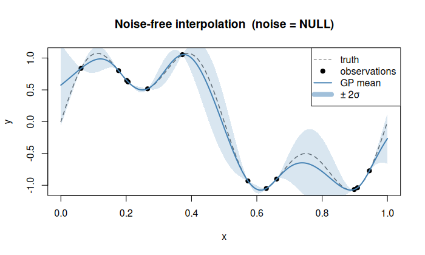

# Noise-free (exact interpolation)

## Description

The default mode (`noise = NULL`). The GP **interpolates** the data exactly:
the posterior mean passes through every observation.

$$
\mathbf{K}(\mathbf{X}, \mathbf{X})\,\boldsymbol{\alpha} = \mathbf{y}, \qquad
\text{i.e. } \hat{f}(\mathbf{x}_i) = y_i \; \forall\, i.
$$

No noise variance is estimated or subtracted.

## When to use

* **Computer experiments** (deterministic simulators) where $y_i = f(\mathbf{x}_i)$ exactly.
* Any clean dataset where you trust every observation.

## Pitfalls

* Ill-conditioned covariance matrices when two design points are very close.
* Over-fitting if the observations contain even small numerical noise.
  Consider `noise = "nugget"` for regularisation in that case.

## Usage

```r
k <- Kriging(y, X, kernel = "matern5_2")
k <- Kriging(y, X, kernel = "matern5_2", noise = NULL)
```

## Example

```r
library(rlibkriging)

f <- function(x) sin(2 * pi * x) + 0.5 * sin(6 * pi * x)
set.seed(1)
n <- 12
X <- as.matrix(runif(n))
y <- f(X)

k <- Kriging(y, X, kernel = "matern5_2")

x <- as.matrix(seq(0, 1, length.out = 300))
p <- k$predict(x, return_stdev = TRUE)

plot(f, xlim = c(0, 1), col = "grey40", lty = 2, lwd = 1,
     ylab = "y", main = "Noise-free interpolation (noise = NULL)")
points(X, y, pch = 19, col = "black")
lines(x, p$mean, col = "steelblue", lwd = 2)
polygon(c(x, rev(x)),
        c(p$mean - 2 * p$stdev, rev(p$mean + 2 * p$stdev)),
        border = NA, col = rgb(0.27, 0.51, 0.71, 0.2))
legend("topright",
       c("truth", "observations", "GP mean", "±2σ"),
       lty = c(2, NA, 1, 1),
       pch = c(NA, 19, NA, NA),
       col = c("grey40", "black", "steelblue", rgb(0.27, 0.51, 0.71, 0.5)),
       lwd = c(1, NA, 2, 8))
```


