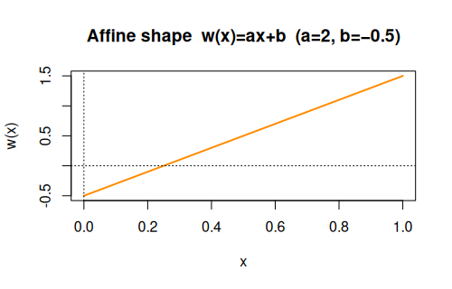
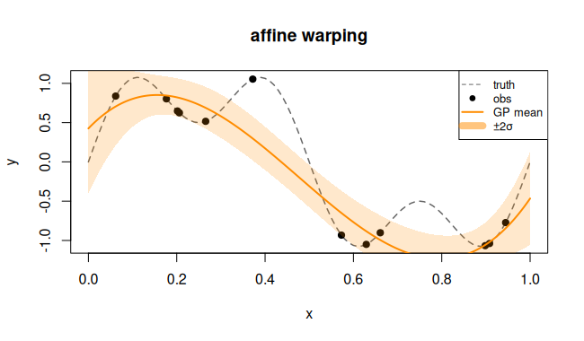

# `affine` — Affine warping

## Description

A learned linear rescaling:

$$w(x) = a\,x + b, \quad a,b \in \mathbb{R}.$$

Useful when the natural scale of an input differs from the domain of the
kernel length-scales.

## Specification

```r
warp_affine()   # returns "affine"
```

## Parameters

| Symbol | Role |
|--------|------|
| $a$    | slope |
| $b$    | intercept |

## Warping shape

```r
library(rlibkriging)
# After fitting, the learned a and b shift / scale the input axis.
# Illustration with fixed a = 2, b = -0.5:
x <- seq(0, 1, length.out = 200)
a <- 2; b <- -0.5
plot(x, a*x + b, type = "l", col = "darkorange", lwd = 2,
     xlab = "x", ylab = "w(x)", main = "Affine warping  w(x) = ax + b")
abline(h = 0, lty = 3); abline(v = 0, lty = 3)
```


## Regression example

```r
library(rlibkriging)
f <- function(x) (2*x - 0.5)^2
set.seed(2)
X <- as.matrix(runif(12))
y <- f(X)

wk <- WarpKriging(y, X, warping = warp_affine(), kernel = "gauss")

x <- as.matrix(seq(0, 1, length.out = 200))
p <- wk$predict(x, return_stdev = TRUE)

plot(f, xlim = c(0,1), col = "grey", lty = 2, ylab = "y",
     main = "affine warping")
points(X, y, pch = 19)
lines(x, p$mean, col = "darkorange", lwd = 2)
polygon(c(x, rev(x)),
        c(p$mean - 2*p$stdev, rev(p$mean + 2*p$stdev)),
        border = NA, col = rgb(1, 0.55, 0, 0.2))
```



