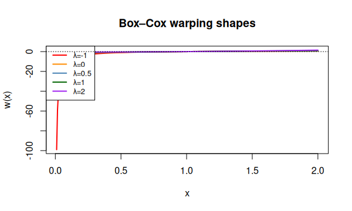
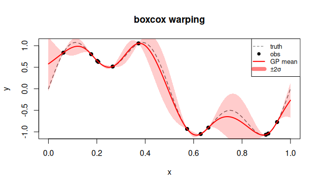

# `boxcox` — Box–Cox warping

## Description

The classic Box–Cox power transform:

$$
w(x;\lambda) =
\begin{cases}
\dfrac{x^\lambda - 1}{\lambda} & \lambda \neq 0 \\
\ln x & \lambda = 0
\end{cases}
$$

Suitable for positive-valued inputs with skewed distributions.

## Specification

```r
warp_boxcox()   # returns "boxcox"
```

## Parameters

| Symbol | Role | Range |
|--------|------|-------|
| $\lambda$ | power exponent | $\mathbb{R}$ |

## Warping shape

```r
x <- seq(0.01, 2, length.out = 300)
boxcox <- function(x, lam) if (abs(lam) < 1e-8) log(x) else (x^lam - 1)/lam

cols <- c("red","darkorange","steelblue","darkgreen","purple")
lambdas <- c(-1, 0, 0.5, 1, 2)
plot(range(x), range(sapply(lambdas, function(l) boxcox(x,l))),
     type = "n", xlab = "x", ylab = "w(x)", main = "Box–Cox warping")
for (i in seq_along(lambdas))
  lines(x, boxcox(x, lambdas[i]), col = cols[i], lwd = 2)
legend("topleft", paste0("λ = ", lambdas), col = cols, lwd = 2)
abline(h = 0, lty = 3)
```


## Regression example

```r
library(rlibkriging)
# Function that is smooth on a log-scale
f <- function(x) log(x + 0.1) + sin(4 * pi * x)
set.seed(3)
X <- as.matrix(runif(15))
y <- f(X)

wk <- WarpKriging(y, X, warping = warp_boxcox(), kernel = "matern5_2")

x <- as.matrix(seq(0, 1, length.out = 200))
p <- wk$predict(x, return_stdev = TRUE)

plot(f, xlim = c(0,1), col = "grey", lty = 2, ylab = "y",
     main = "boxcox warping")
points(X, y, pch = 19)
lines(x, p$mean, col = "red", lwd = 2)
polygon(c(x, rev(x)),
        c(p$mean - 2*p$stdev, rev(p$mean + 2*p$stdev)),
        border = NA, col = rgb(1, 0, 0, 0.15))
```



## Reference

Box, G. E. P., & Cox, D. R. (1964). An Analysis of Transformations. *Journal of the Royal Statistical Society: Series B*, 26(2), 211–252.
DOI: [10.1111/j.2517-6161.1964.tb00553.x](https://doi.org/10.1111/j.2517-6161.1964.tb00553.x)

