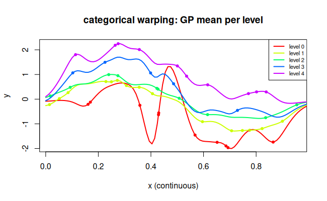

# `categorical` — Categorical embedding warping

## Description

Maps a nominal (unordered) categorical variable with $L$ levels
(integer-coded $0, 1, \ldots, L-1$) to a learned $q$-dimensional
continuous embedding:

$$w(x) = \mathbf{e}_{x} \in \mathbb{R}^q, \quad \mathbf{e}_0,\dots,\mathbf{e}_{L-1} \text{ learned freely}.$$

The GP kernel then measures distances in this embedding space.

## Specification

```r
warp_categorical(n_levels = 5, embed_dim = 2)
# returns e.g. "categorical(5,2)"
```

## Parameters

| Argument | Role |
|----------|------|
| `n_levels` | number of distinct levels $L$ |
| `embed_dim` | embedding dimensionality $q$ (default 2) |

## Regression example

```r
library(rlibkriging)

set.seed(10)
n_levels <- 5
n        <- 50

# Input: one continuous + one categorical (0..4)
X_cont <- runif(n)
X_cat  <- sample(0:(n_levels-1), n, replace = TRUE)
X      <- cbind(X_cont, X_cat)

# Response depends on category
level_effect <- c(-1.0, -0.3, 0.0, 0.5, 1.2)
y <- sin(2 * pi * X_cont) + level_effect[X_cat + 1] + 0.05 * rnorm(n)

wk <- WarpKriging(
  y, X,
  warping = c(warp_kumaraswamy(), warp_categorical(n_levels, embed_dim = 2)),
  kernel  = "matern5_2",
  optim   = "BFGS+Adam"
)

# Predict for each category over the continuous range
x_seq <- seq(0, 1, length.out = 100)
cols  <- rainbow(n_levels)
plot(X_cont, y, col = cols[X_cat + 1], pch = 19, cex = 0.7,
     xlab = "x (continuous)", ylab = "y",
     main = "categorical warping: GP mean per level")
for (lev in 0:(n_levels-1)) {
  X_pred <- cbind(x_seq, lev)
  p <- wk$predict(X_pred, return_stdev = FALSE)
  lines(x_seq, p$mean, col = cols[lev + 1], lwd = 2)
}
legend("topright", paste("level", 0:(n_levels-1)),
       col = cols, lwd = 2, cex = 0.7)
```



## Reference

Garrido-Merchán, E. C., & Hernández-Lobato, D. (2020). Dealing with Categorical and Integer-Valued Variables in Bayesian Optimization with Gaussian Processes. *Neurocomputing*, 380, 20–35.
DOI: [10.1016/j.neucom.2019.11.004](https://doi.org/10.1016/j.neucom.2019.11.004) · arXiv: [1805.03463](https://arxiv.org/abs/1805.03463)

