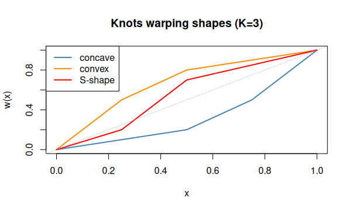
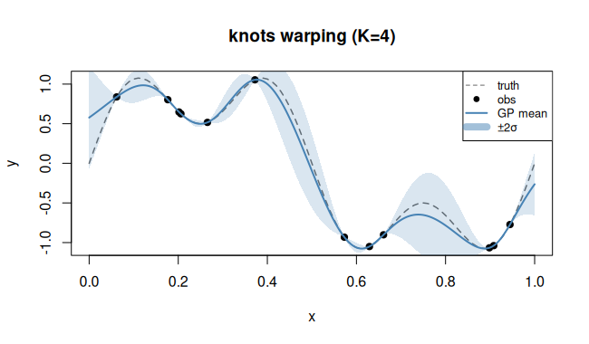

# `knots` — Piecewise-linear monotone warping

## Description

A piecewise-linear monotone transform with $K$ free interior knots
(Xiong et al. 2007):

$$w(x) = \text{piecewise-linear interpolation through } (0,0),(t_1,s_1),\dots,(t_K,s_K),(1,1),$$

where the knot heights $s_i$ are optimised subject to the monotonicity
constraint $0 < s_1 < \cdots < s_K < 1$.

## Specification

```r
warp_knots(n_knots = 3)           # equally-spaced knots
warp_knots(knot_positions = c(0.25, 0.5, 0.75))  # custom positions
```

## Parameters

| Symbol | Role |
|--------|------|
| $K$ | number of interior knots (`n_knots`) |
| $t_1,\dots,t_K$ | knot positions (fixed, default equally-spaced) |
| $s_1,\dots,s_K$ | knot heights (learned) |

## Warping shape

```r
# Illustrate several monotone piecewise-linear shapes
x <- seq(0, 1, length.out = 200)

# Manual illustration: 3 knots at 0.25, 0.5, 0.75 with different heights
piecewise_lin <- function(x, knot_pos, knot_h) {
  nodes_x <- c(0, knot_pos, 1)
  nodes_y <- c(0, knot_h, 1)
  approx(nodes_x, nodes_y, x)$y
}

params <- list(
  list(pos = c(0.25, 0.5, 0.75), h = c(0.1, 0.2, 0.5)),   # concave
  list(pos = c(0.25, 0.5, 0.75), h = c(0.5, 0.8, 0.9)),   # convex
  list(pos = c(0.25, 0.5, 0.75), h = c(0.2, 0.7, 0.85))   # S-shape
)
cols <- c("steelblue","darkorange","red")
labs <- c("concave","convex","S-shape")

plot(0:1, 0:1, type="n", xlab="x", ylab="w(x)",
     main="Knots warping shapes (K=3)")
for (i in seq_along(params))
  lines(x, piecewise_lin(x, params[[i]]$pos, params[[i]]$h),
        col=cols[i], lwd=2)
abline(0, 1, lty=3, col="grey70")
legend("topleft", labs, col=cols, lwd=2)
```


## Regression example

```r
library(rlibkriging)
# Function with non-uniform "density" — slow then fast
f <- function(x) sin(2 * pi * x^3)
set.seed(7)
X <- as.matrix(runif(15))
y <- f(X)

wk <- WarpKriging(y, X,
                  warping = warp_knots(n_knots = 4),
                  kernel  = "matern5_2",
                  optim   = "BFGS+Adam")

x <- as.matrix(seq(0, 1, length.out = 200))
p <- wk$predict(x, return_stdev = TRUE)

plot(f, xlim = c(0,1), col = "grey", lty = 2, ylab = "y",
     main = "knots warping (K=4)")
points(X, y, pch = 19)
lines(x, p$mean, col = "steelblue", lwd = 2)
polygon(c(x, rev(x)),
        c(p$mean - 2*p$stdev, rev(p$mean + 2*p$stdev)),
        border = NA, col = rgb(0.27, 0.51, 0.71, 0.2))
```


## Reference

Xiong, Y., Chen, W., Apley, D., & Ding, X. (2007). *A non-stationary covariance-based Kriging method for metamodelling in engineering design*. International Journal for Numerical Methods in Engineering, 71(6), 733–756.
DOI: [10.1002/nme.1969](https://doi.org/10.1002/nme.1969)
