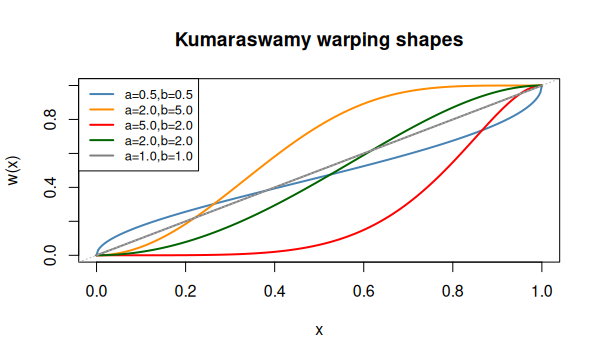
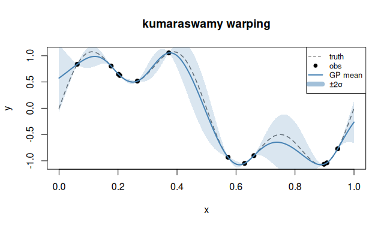

# `kumaraswamy` — Kumaraswamy warping

## Description

The Kumaraswamy CDF maps $[0,1] \to [0,1]$:

$$w(x; a, b) = 1 - (1 - x^a)^b, \quad a,b > 0.$$

It generalises the Beta CDF with a closed-form inverse, making it ideal for
inputs bounded in $[0,1]$. Shape is S-curve, left-skewed or right-skewed
depending on $(a,b)$.

## Specification

```r
warp_kumaraswamy()   # returns "kumaraswamy"
```

## Parameters

| Symbol | Role | Range |
|--------|------|-------|
| $a$ | first shape | $>0$ |
| $b$ | second shape | $>0$ |

## Warping shape

```r
kuma <- function(x, a, b) 1 - (1 - x^a)^b
x <- seq(0, 1, length.out = 300)
params <- list(c(0.5, 0.5), c(2, 5), c(5, 2), c(2, 2), c(1, 1))
cols   <- c("steelblue","darkorange","red","darkgreen","grey50")
labels <- sapply(params, function(p) sprintf("a=%.1f, b=%.1f", p[1], p[2]))

plot(0:1, 0:1, type="n", xlab="x", ylab="w(x)",
     main="Kumaraswamy warping shapes")
for (i in seq_along(params))
  lines(x, kuma(x, params[[i]][1], params[[i]][2]), col=cols[i], lwd=2)
legend("topleft", labels, col=cols, lwd=2, cex=0.8)
abline(0, 1, lty=3, col="grey70")
```


## Regression example

```r
library(rlibkriging)
# Nonlinear function on [0,1]
f <- function(x) sin(pi * x^2) + 0.3 * cos(8 * pi * x)
set.seed(42)
X <- as.matrix(runif(15))
y <- f(X)

wk <- WarpKriging(y, X,
                  warping = warp_kumaraswamy(),
                  kernel  = "matern5_2",
                  optim   = "BFGS+Adam")

x <- as.matrix(seq(0, 1, length.out = 200))
p <- wk$predict(x, return_stdev = TRUE)

plot(f, xlim = c(0,1), col = "grey", lty = 2, ylab = "y",
     main = "kumaraswamy warping")
points(X, y, pch = 19)
lines(x, p$mean, col = "steelblue", lwd = 2)
polygon(c(x, rev(x)),
        c(p$mean - 2*p$stdev, rev(p$mean + 2*p$stdev)),
        border = NA, col = rgb(0.27, 0.51, 0.71, 0.2))
```



## References

Snoek, J., Swersky, K., Zemel, R. S., & Adams, R. P. (2014). Input Warping for Bayesian Optimization of Non-Stationary Functions. *Proceedings of ICML 2014*, PMLR 32(2):1674–1682.
arXiv: [1402.0929](https://arxiv.org/abs/1402.0929)

Kumaraswamy, P. (1980). A generalized probability density function for double-bounded random processes. *Journal of Hydrology*, 46(1–2), 79–88.
DOI: [10.1016/0022-1694(80)90008-X](https://doi.org/10.1016/0022-1694(80)90008-X)

