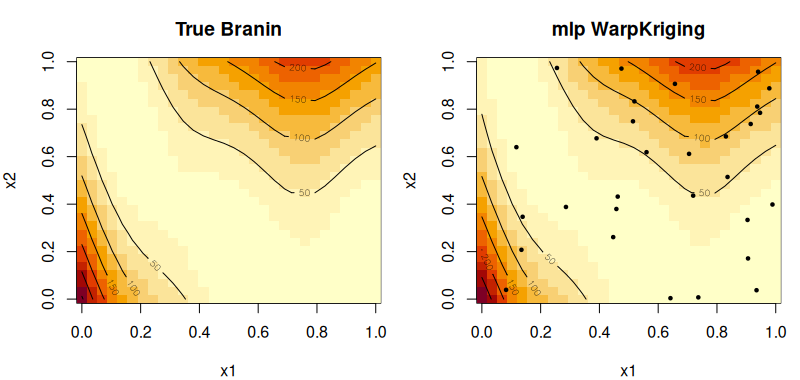

# `mlp` — Per-variable MLP warping

## Description

An unconstrained multi-layer perceptron mapping one input variable to a
$q$-dimensional feature vector:

$$w_j : \mathbb{R} \to \mathbb{R}^q, \quad w_j(x_j) = \mathrm{MLP}(x_j; W_j).$$

Unlike `neural_mono`, **no monotonicity is enforced**. The output
dimensionality $q > 1$ expands the effective feature space of the kernel.

:::{note}
For a **joint** MLP across all inputs simultaneously, use
[`MLPKriging`](../functions/MLPKriging.md) instead.
:::

## Specification

```r
warp_mlp(hidden_dims = c(16, 8), d_out = 2, activation = "selu")
# returns e.g. "mlp(16:8,2,selu)"
```

## Parameters

| Argument | Role | Default |
|----------|------|---------|
| `hidden_dims` | hidden layer widths | `c(16, 8)` |
| `d_out` | output feature dimension $q$ | `2` |
| `activation` | `"relu"`, `"selu"`, `"tanh"`, `"sigmoid"`, `"elu"` | `"selu"` |

## Regression example

```r
library(rlibkriging)
# 2-D Branin function
branin <- function(x) {
  x1 <- x[,1] * 15 - 5
  x2 <- x[,2] * 15
  (x2 - 5/(4*pi^2)*x1^2 + 5/pi*x1 - 6)^2 +
    10*(1 - 1/(8*pi))*cos(x1) + 10
}

set.seed(42)
n <- 40
X <- matrix(runif(n * 2), n, 2)
y <- branin(X)

# Per-variable MLP warping
wk <- WarpKriging(y, X,
                  warping = c(warp_mlp(c(8L, 4L), d_out = 2L, activation = "selu"),
                              warp_mlp(c(8L, 4L), d_out = 2L, activation = "selu")),
                  kernel  = "matern5_2",
                  optim   = "BFGS+Adam")

# Predict on a grid
grid <- expand.grid(x1 = seq(0,1,length.out=40),
                    x2 = seq(0,1,length.out=40))
p <- wk$predict(as.matrix(grid), return_stdev = FALSE)
z <- matrix(p$mean, 40, 40)

# Plot predicted surface vs truth
par(mfrow = c(1, 2))
image(seq(0,1,l=40), seq(0,1,l=40),
      matrix(branin(as.matrix(grid)), 40, 40),
      main = "True Branin", xlab = "x1", ylab = "x2")
contour(seq(0,1,l=40), seq(0,1,l=40),
        matrix(branin(as.matrix(grid)), 40, 40), add=TRUE)
image(seq(0,1,l=40), seq(0,1,l=40), z,
      main = "mlp WarpKriging mean", xlab = "x1", ylab = "x2")
contour(seq(0,1,l=40), seq(0,1,l=40), z, add=TRUE)
points(X[,1], X[,2], pch=19, cex=0.5)
par(mfrow = c(1, 1))
```



