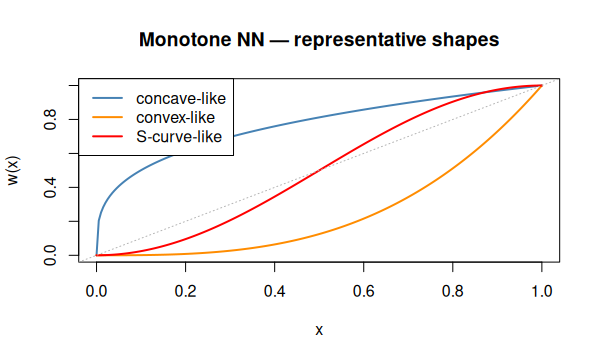
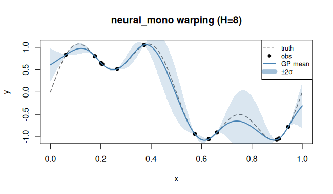

# `neural_mono` — Monotone neural network warping

## Description

A small monotone neural network warping:

$$w(x) = \mathrm{NN}_{\text{mono}}(x; W), \quad W > 0 \text{ (weight positivity enforced)}.$$

Monotonicity is guaranteed by using non-negative weights throughout, enabling
a highly flexible strictly increasing transform with $3H+1$ parameters for
$H$ hidden units.

## Specification

```r
warp_neural_mono()            # default: H = 8 hidden units → "neural_mono(8)"
warp_neural_mono(n_hidden = 16)   # more capacity
```

## Parameters

| Symbol | Role |
|--------|------|
| $H$ | number of hidden units (`n_hidden`, default 8) |

## Warping shape

```r
# Monotone NN shapes are data-driven; illustrate diversity schematically
x <- seq(0, 1, length.out = 200)

# Three plausible shapes a monotone NN might learn
shapes <- list(
  function(x) pmin(1, pmax(0, x^0.3)),
  function(x) pmin(1, pmax(0, x^3)),
  function(x) pmin(1, pmax(0, (sin(pi*(x-0.5)) + 1)/2))
)
cols <- c("steelblue","darkorange","red")
labs <- c("concave-like","convex-like","S-curve-like")

plot(0:1, 0:1, type="n", xlab="x", ylab="w(x)",
     main="Monotone NN warping — representative shapes")
for (i in seq_along(shapes))
  lines(x, shapes[[i]](x), col=cols[i], lwd=2)
abline(0, 1, lty=3, col="grey70")
legend("topleft", labs, col=cols, lwd=2)
```


## Regression example

```r
library(rlibkriging)
f <- function(x) sin(2 * pi * x^2)
set.seed(5)
X <- as.matrix(runif(15))
y <- f(X)

wk <- WarpKriging(y, X,
                  warping = warp_neural_mono(n_hidden = 8),
                  kernel  = "matern5_2",
                  optim   = "BFGS+Adam")

x <- as.matrix(seq(0, 1, length.out = 200))
p <- wk$predict(x, return_stdev = TRUE)

plot(f, xlim=c(0,1), col="grey", lty=2,
     ylab="y", main="neural_mono warping (H=8)")
points(X, y, pch = 19)
lines(x, p$mean, col="steelblue", lwd=2)
polygon(c(x, rev(x)),
        c(p$mean - 2*p$stdev, rev(p$mean + 2*p$stdev)),
        border=NA, col=rgb(0.27,0.51,0.71,0.2))
```



## References

Snelson, E., Rasmussen, C. E., & Ghahramani, Z. (2004). Warped Gaussian Processes. *Advances in Neural Information Processing Systems 16 (NeurIPS 2003)*, pp. 337–344.
URL: [papers.nips.cc/paper/2603](https://papers.nips.cc/paper/2603-warped-gaussian-processes)

Snoek, J., Swersky, K., Zemel, R. S., & Adams, R. P. (2014). Input Warping for Bayesian Optimization of Non-Stationary Functions. *Proceedings of ICML 2014*, PMLR 32(2):1674–1682.
arXiv: [1402.0929](https://arxiv.org/abs/1402.0929)

