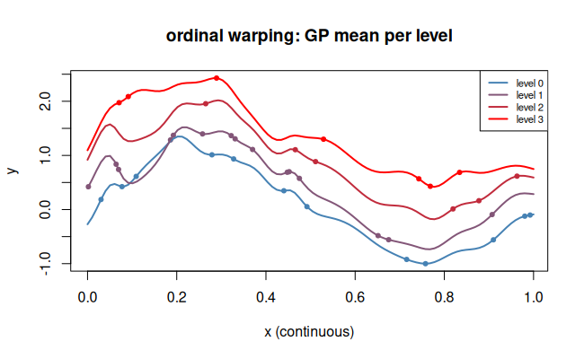

# `ordinal` — Ordinal warping

## Description

Maps an ordinal variable with $L$ levels ($0,1,\ldots,L-1$) to a
scalar through a set of $L-1$ **learned, ordered positions** on the real
line:

$$w(x) = s_x \in \mathbb{R}, \quad s_0 < s_1 < \cdots < s_{L-1}.$$

Unlike `categorical`, the ordering constraint is enforced, which reduces
the number of free parameters and improves generalisation.

## Specification

```r
warp_ordinal(n_levels = 4)
# returns e.g. "ordinal(4)"
```

## Parameters

| Argument | Role |
|----------|------|
| `n_levels` | number of ordered levels $L$ |

## Regression example

```r
library(rlibkriging)

set.seed(20)
n_levels <- 4
n        <- 40

# Continuous + ordinal input
X_cont <- runif(n)
X_ord  <- sample(0:(n_levels-1), n, replace = TRUE)
X      <- cbind(X_cont, X_ord)

# Response increases with ordinal level
level_val <- c(0, 0.4, 0.9, 1.5)
y <- sin(2 * pi * X_cont) + level_val[X_ord + 1] + 0.05 * rnorm(n)

wk <- WarpKriging(
  y, X,
  warping = c(warp_kumaraswamy(), warp_ordinal(n_levels)),
  kernel  = "matern5_2",
  optim   = "BFGS+Adam"
)

x_seq <- seq(0, 1, length.out = 100)
cols  <- colorRampPalette(c("steelblue","red"))(n_levels)
plot(X_cont, y, col = cols[X_ord + 1], pch = 19, cex = 0.7,
     xlab = "x (continuous)", ylab = "y",
     main = "ordinal warping: GP mean per level")
for (lev in 0:(n_levels-1)) {
  X_pred <- cbind(x_seq, lev)
  p <- wk$predict(X_pred, return_stdev = FALSE)
  lines(x_seq, p$mean, col = cols[lev + 1], lwd = 2)
}
legend("topright", paste("level", 0:(n_levels-1)),
       col = cols, lwd = 2, cex = 0.7)
```


## Comparison with `categorical`

| Property | `ordinal` | `categorical` |
|----------|-----------|---------------|
| Ordering constraint | ✔ enforced | ✘ ignored |
| Free parameters | $L-1$ | $L \times q$ |
| Suitable when | levels have a natural order | levels are unordered |
